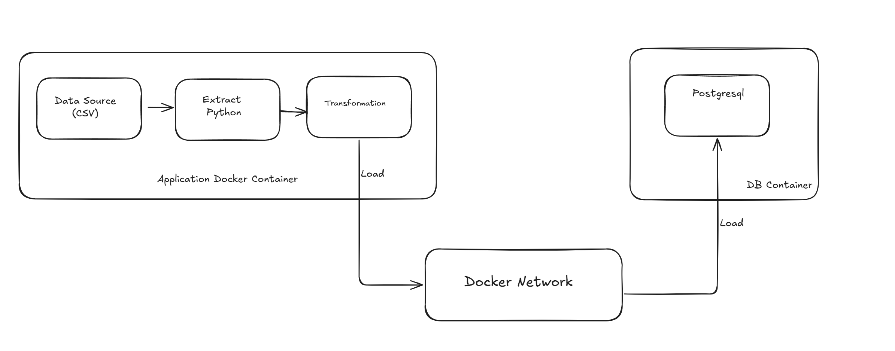

# Containerized ETL Pipeline

A comprehensive Extract, Transform, Load (ETL) pipeline built with Docker containers, featuring PostgreSQL database integration and automated data processing of internet usage statistics.

## 🏗️ Architecture Overview

This project implements a containerized ETL pipeline with the following components:

- **ETL Application Container**: Python-based data processing engine
- **PostgreSQL Database Container**: Persistent data storage
- **Docker Network**: Secure container-to-container communication
- **Bash Orchestration Script**: Automated deployment and management



## 📋 Features

### ETL Pipeline Capabilities
- ✅ **Extract**: Reads internet usage data from CSV files
- ✅ **Transform**: Converts year columns to clean integers, handles missing values
- ✅ **Load**: Stores processed data in both CSV and PostgreSQL database
- ✅ **Data Validation**: Comprehensive error handling and data type conversion
- ✅ **Progress Logging**: Detailed logging with timestamps

### Containerization Features
- 🐳 **Docker Multi-Container Setup**: Separate containers for application and database
- 🔗 **Custom Docker Network**: Secure inter-container communication
- 🌍 **Environment Configuration**: Environment variables for database connection
- 🔄 **Automated Orchestration**: Single script deployment and management
- 🧹 **Resource Cleanup**: Automatic cleanup of containers and networks

### Database Features
- 📊 **PostgreSQL Integration**: Professional-grade database storage
- 🏗️ **Dynamic Schema Creation**: Automatic table creation with proper data types
- 🔄 **Data Refresh**: Cleans existing data before loading new records
- 📈 **Bulk Insert Operations**: Efficient data loading using executemany
- 🛡️ **Transaction Management**: ACID compliance with rollback on errors

## 📁 Project Structure

```
ETL/
├── README.md                 # Project documentation
├── run_etl.sh               # Main orchestration script
├── .gitignore               # Git ignore patterns
├── app/                     # ETL Application
│   ├── Dockerfile           # Python app container blueprint
│   ├── requirements.txt     # Python dependencies
│   ├── etl.py              # Main ETL pipeline script
│   └── internet_users.csv  # Source data file
└── etl_database/           # Database Container
    └── Dockerfile          # PostgreSQL container blueprint
```

## 🚀 Quick Start

### Prerequisites
- Docker installed and running
- Docker Compose (optional)
- Git (for cloning)

### Installation

1. **Clone the repository**
   ```bash
   git clone https://github.com/Celnet-hub/Containerised-ETL-Pipeline.git
   cd Containerised-ETL-Pipeline/ETL
   ```

2. **Make the script executable**
   ```bash
   chmod +x run_etl.sh
   ```

3. **Run the ETL pipeline**
   ```bash
   ./run_etl.sh
   ```

### What Happens When You Run the Pipeline

1. **Cleanup**: Removes any existing containers and networks (Optional)
2. **Network Creation**: Creates `etl-network` for container communication
3. **Image Building**: 
   - Builds PostgreSQL database image
   - Builds Python ETL application image
4. **Database Startup**: Launches PostgreSQL container with initialization
5. **ETL Execution**: Runs the data processing pipeline
6. **Status Display**: Shows container status and recent logs

## 📊 Data Processing Details

### Source Data
The pipeline processes internet usage statistics with the following columns:
- `Location`: Country/region name
- `Rate (WB)`: World Bank internet usage rate
- `Year`: World Bank data year
- `Rate (ITU)`: ITU internet usage rate  
- `Year.1`: ITU data year
- `Users (CIA)`: CIA internet users count
- `Year.2`: CIA data year
- `Notes`: Additional information

### Transformations Applied
1. **Year Normalization**: Converts floating-point years (2023.0) to integers (2023)
2. **Missing Value Handling**: Properly handles NaN values for database insertion
3. **Data Type Conversion**: Ensures proper data types for database storage
4. **Column Mapping**: Maps source columns to database schema

### Output
- **CSV File**: `transformed_internet_users_data.csv`
- **Database Table**: `internet_users` in PostgreSQL with 238+ records

## 🐳 Docker Configuration

### ETL Application Container
```dockerfile
FROM python:3.12-alpine
WORKDIR /usr/src/app
COPY requirements.txt ./
RUN pip install --no-cache-dir -r requirements.txt
COPY . .
CMD [ "python", "./etl.py" ]
```

### PostgreSQL Container
```dockerfile
FROM postgres:15
ENV POSTGRES_USER=admin
ENV POSTGRES_DB=app_db
```

### Dependencies
- pandas: Data manipulation and analysis
- numpy: Numerical computing
- psycopg2-binary: PostgreSQL adapter
- sqlalchemy: SQL toolkit (optional)

## 🔧 Configuration

### Environment Variables
The ETL application uses these environment variables for database connection:

| Variable | Default | Description |
|----------|---------|-------------|
| `DB_HOST` | localhost | PostgreSQL host (container name in Docker) |
| `DB_NAME` | app_db | Database name |
| `DB_USER` | admin | Database username |
| `DB_PASSWORD` | `<your-password>` | Database password |
| `DB_PORT` | 5432 | Database port |

### Docker Network Configuration
- **Network Name**: `etl-network`
- **Driver**: bridge
- **Container Communication**: By container name
- **Port Mapping**: PostgreSQL accessible on host port 5432

## 📈 Monitoring and Logs

### Viewing Logs
```bash
# View ETL application logs
docker logs etl-app

# View PostgreSQL logs  
docker logs etl-postgres-db

# Follow logs in real-time
docker logs -f etl-app
```

### Database Access
```bash
# Connect to PostgreSQL
docker exec -it etl-postgres-db psql -U admin -d app_db

# Check data count
docker exec -it etl-postgres-db psql -U admin -d app_db -c "SELECT COUNT(*) FROM internet_users;"

# View sample data
docker exec -it etl-postgres-db psql -U admin -d app_db -c "SELECT * FROM internet_users LIMIT 5;"
```

## 🛠️ Development

### Running Locally (without Docker)
1. Install Python dependencies:
   ```bash
   cd app/
   pip install -r requirements.txt
   ```

2. Start PostgreSQL locally or use Docker:
   ```bash
   docker run -d --name postgres-dev -e POSTGRES_PASSWORD=<your-password> -p 5432:5432 postgres:15
   ```

3. Run the ETL script:
   ```bash
   python etl.py
   ```

### Customizing the Pipeline

#### Adding New Data Sources
1. Add CSV files to the `app/` directory
2. Update the `extract()` function in `etl.py`
3. Modify transformations as needed

#### Changing Database Schema
1. Update the table creation query in `load_data()` function
2. Modify column mappings in the insert statements
3. Rebuild the application container

#### Adding New Transformations
1. Extend the `transform()` function in `etl.py`
2. Add any new dependencies to `requirements.txt`
3. Test thoroughly before deployment

## 🧪 Testing

### Manual Testing
```bash
# Test database connection
docker exec -it etl-postgres-db psql -U admin -d app_db -c "\dt"

# Verify data integrity
docker exec -it etl-postgres-db psql -U admin -d app_db -c "SELECT location, year_wb FROM internet_users WHERE year_wb IS NOT NULL LIMIT 10;"

# Check for data anomalies
docker exec -it etl-postgres-db psql -U admin -d app_db -c "SELECT COUNT(*) as total_rows, COUNT(location) as non_null_locations FROM internet_users;"
```

### Automated Testing
The pipeline includes basic validation:
- Connection testing before data processing
- Data type validation during transformation
- Transaction rollback on database errors
- Comprehensive error logging

## 🚨 Troubleshooting

### Common Issues

1. **Docker not found**
   - Ensure Docker is installed and running
   - Check Docker Desktop WSL2 integration (Windows)

2. **Container connection failed**
   - Verify Docker network exists: `docker network ls`
   - Check container status: `docker ps`
   - Review container logs: `docker logs <container-name>`

3. **Database connection timeout**
   - Increase wait time in `run_etl.sh` (default: 10 seconds)
   - Check PostgreSQL container logs for initialization issues

4. **Data not loading**
   - Verify CSV file exists in `app/` directory
   - Check file permissions and format
   - Review ETL application logs

### Manual Cleanup
```bash
# Stop all containers
docker stop etl-postgres-db etl-app

# Remove containers
docker rm etl-postgres-db etl-app

# Remove network
docker network rm etl-network

# Remove images (optional)
docker rmi etl-postgres etl-app-image
```

## 🔒 Security Considerations

- Database passwords should be stored in environment files or secrets management
- Consider using Docker secrets for production deployments
- Network isolation prevents external access to containers
- Regular security updates for base images recommended

## 📝 Performance Notes

- **Data Volume**: Optimized for datasets up to 10,000 records
- **Memory Usage**: Alpine Linux base images minimize footprint
- **Processing Time**: Typical execution time 30-60 seconds for full pipeline
- **Scalability**: Can be extended with Docker Compose for larger deployments

## 🤝 Contributing

1. Fork the repository
2. Create a feature branch: `git checkout -b feature-name`
3. Make your changes and test thoroughly
4. Commit your changes: `git commit -m 'Add feature'`
5. Push to the branch: `git push origin feature-name`
6. Submit a pull request

## 📄 License

This project is open source and available under the [MIT License](LICENSE).

## 👥 Authors

- **Celnet-hub** - Initial work and development

## 🙏 Acknowledgments

- PostgreSQL community for the excellent database system
- Docker for containerization technology
- Python pandas community for data processing tools
- Alpine Linux for lightweight container images

---

For questions, issues, or suggestions, please open an issue in the GitHub repository.
